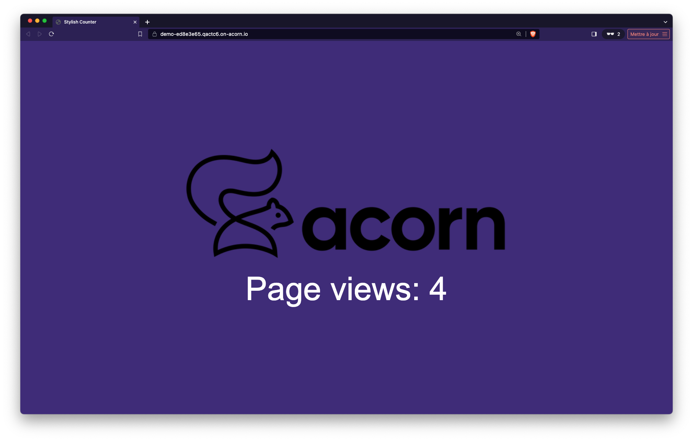

## What is MongoDB ?

MongoDB is a popular, open-source NoSQL database system that uses a document-oriented data model. It operates with documents in a human-readable JSON-like format. It's known for its scalability and flexibility, allowing for complex queries, indexing, real-time aggregation, and server-side JavaScript execution.

## Mongo as an Acorn Service

The Acornfile used to create a MongoDB based Acorn Service is available in the GitHub repository at [https://github.com/acorn-io/mongodb](https://github.com/acorn-io/mongodb). This service triggers the creation of a MongoDB database running in a single container which can easily be used by an application during development.

This MongoDB instance:

- is backed by a persistent volume
- uses a default (auto generated) password for the root user
- defines credentials for an additional user (with access limited to a given database)

The Acorn image of this service is hosted in GitHub container registry at [ghcr.io/acorn-io/mongodb](ghcr.io/acorn-io/mongodb)

Currently this Acorn has the following configuration options:

- *dbUser* of the additional user is automatically generated
- *dbName* is set to "mydb"

These values can be changed using the *serviceArgs* property as follow:

```
services: db: {
  image: "ghcr.io/acorn-io/mongodb:v#.#-#"
  serviceArgs: {
    dbUser: "bar"
    dbName: "foo"
  }
}
```

## Usage

The [examples folder](https://github.com/acorn-io/mongodb/tree/main/examples) contains a sample application using this Service. This app consists in a Python backend based on the FastAPI library, it displays a web page indicating the number of times the application was called, a counter is saved in the underlying MongoDB database and incremented with each request. The screenshot below shows the UI of the example application.



To use the Mongo Service, we first define a *service* property in the Acornfile of the application:

```
services: db: {
  image: "ghcr.io/acorn-io/mongodb:v#.#-#"
}
```

Next we define the application container. This one can connect to the MongoDB service via environment variables which values are set based on the service's properties.

```
containers: {
  app: {
    build: {
      context: "."
      target: "dev"
    }
    consumes: ["db"]
    ports: publish: "8000/http"
    env: {
      DB_HOST: "@{service.db.address}"
      DB_PORT: "@{service.db.port.27017}"
      DB_NAME: "@{service.db.data.dbName}"
      DB_USER: "@{service.db.secrets.user.username}"
      DB_PASS: "@{service.db.secrets.user.password}"
    }
  }
}
```

Note: This example uses the auto-generated user, which is limited to the default database. We could have used the admin user instead, this one does not have any limitation on the whole mongodb instance:

```
containers: {
  app: {
    build: {
      context: "."
      target: "dev"
    }
    consumes: ["db"]
    ports: publish: "8000/http"
    env: {
      DB_HOST: "@{service.db.address}"
      DB_PORT: "@{service.db.port.27017}"
      DB_USER: "@{service.db.secrets.admin.username}"   <-- using the admin user
      DB_PASS: "@{service.db.secrets.admin.password}"   <-- using the admin pass
    }
  }
}
```

This container is built using the Dockerfile in the examples folder. Once built, the container consumes the MongoDB service using the address and credentials provided through via the dedicated variables.

This example can be run with the following command (to be run from the *examples* folder)

```
acorn run -n app
```

After a few tens of seconds an http endpoint will be returned. Using this endpoint we can access the application and see the counter incremented on each reload of the page.

## About Acorn Sandbox

Instead of managing your own Acorn installation, you can deploy this application in the Acorn Sandbox, the free SaaS offering provided by Acorn. Access to the sandbox requires only a GitHub account, which is used for authentication.

[](https://acorn.io/run/ghcr.io/acorn-io/mongodb/examples:v%23.%23-%23)

An application running in the Sandbox will automatically shut down after 2 hours, but you can use the Acorn Pro plan to remove the time limit and gain additional functionalities.

## Disclaimer

Disclaimer: You agree all software products on this site, including Acorns or their contents, may contain projects and materials subject to intellectual property restrictions and/or Open-Source license (“Restricted Items”). Restricted Items found anywhere within this Acorn or on Acorn.io are provided “as-is” without warranty of any kind and are subject to their own Open-Source licenses and your compliance with such licenses are solely and exclusively your responsibility. [MongoDB](https://mongodb.com) is licensed under Server Side Public License (SSPL) v1 which can be found [here](https://github.com/mongodb/mongo/blob/master/LICENSE-Community.txt) and Acorn.io does not endorse and is not affiliated with MongoDB. By using Acorn.io you agree to our general disclaimer here: <https://www.acorn.io/terms-of-use>.
